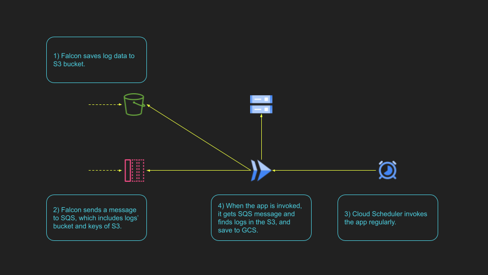

# gcp-falcon-data-forwarder

## What is this

This Cloud Run app receives SQS message(s) from Data Replicator of CrowdStrike Falcon and transfer log files to your own GCS bucket.

## Architecture

## Prerequisite

- Tools
  - go >= 1.16
  - gcloud
- Your GCP resources
  - GCS bucket for log data (e.g. `my-log-bucket` )
  - Cloud Run
  - Cloud Scheduler

Make sure that you need CrowdStrike Falcon and Data Replicator service.

## Setup

TBD

Example terrafom will be provided.

## License

MIT License

